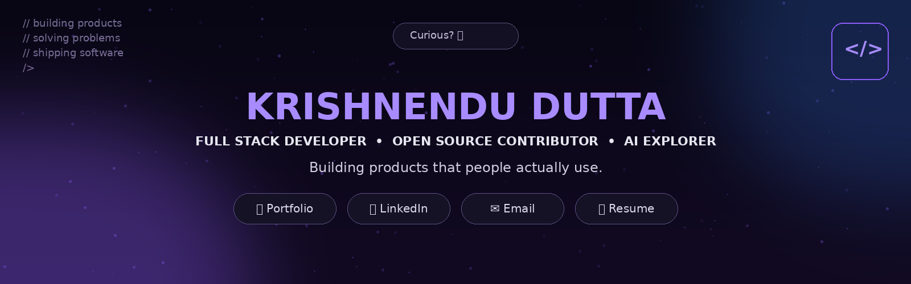
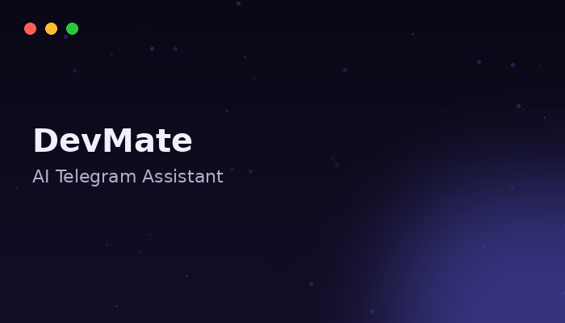
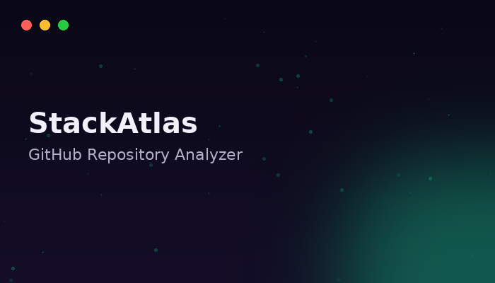
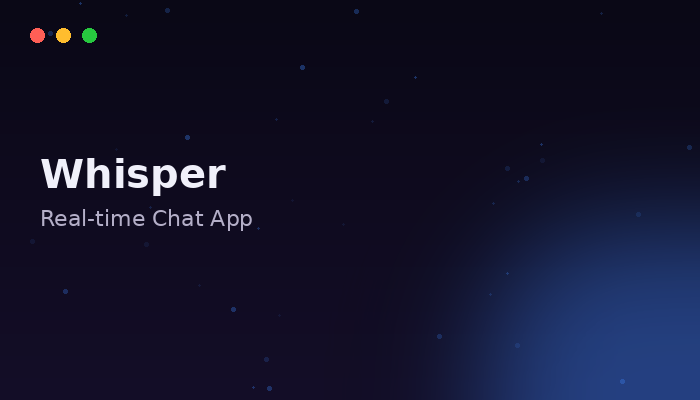
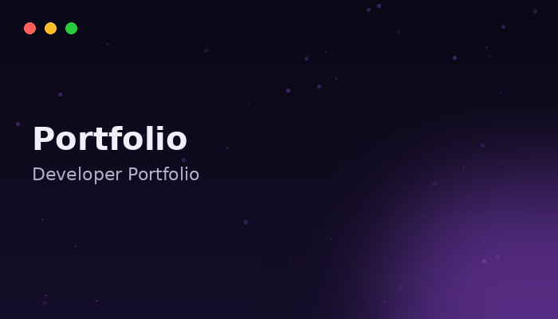

 

 

<table>
<tr>
<td width="50%" valign="top">

### 🧑‍💻 Who Am I?

- 🎓 Computer Science Student
- 💼 Software Engineering Intern
- 🌱 20+ Merged Open Source PRs
- 🚀 Full Stack Developer
- 🤖 Exploring AI & Machine Learning
- 🐧 Linux Enthusiast

</td>
<td width="50%" valign="top">

### 🎯 Current Mission

- 🏗️ Building production-ready applications
- 🌍 Contributing to Open Source
- ☕ Learning Spring Boot
- 🧠 Exploring Machine Learning
- 🎨 Crafting beautiful user experiences

</td>
</tr>
</table>

 

## ⭐ Featured Projects

<table>
<tr>
<td width="50%">

**DevMate** — AI Telegram Assistant
AI-powered Telegram assistant with Gemini API.

`Python` `Docker` `Gemini`

[`💻 Code`](https://github.com/dev-krish/DevMate) &nbsp;•&nbsp; [`🚀 Live`](#)

</td>
<td width="50%">

**StackAtlas** — GitHub Repository Analyzer
AI-powered GitHub repository analyzer.

`Next.js` `MongoDB` `API`

[`💻 Code`](https://github.com/dev-krish/StackAtlas) &nbsp;•&nbsp; [`🚀 Live`](#)

</td>
</tr>
<tr>
<td width="50%">

**Whisper** — Real-time Chat App
Real-time chat application using MERN stack.

`React` `Node.js` `Socket.IO`

[`💻 Code`](https://github.com/dev-krish/Whisper) &nbsp;•&nbsp; [`🚀 Live`](#)

</td>
<td width="50%">

**Portfolio** — Developer Portfolio
Modern & interactive personal portfolio website.

`Next.js` `Tailwind CSS` `Framer`

[`💻 Code`](https://github.com/dev-krish/Portfolio) &nbsp;•&nbsp; [`🚀 Live`](https://dev-krish.vercel.app)

</td>
</tr>
</table>

 

## 🛠️ Tech Arsenal

<table>
<tr>
<td align="center" valign="top" width="16.6%">

**Languages**
  

</td>
<td align="center" valign="top" width="16.6%">

**Frontend**
  

</td>
<td align="center" valign="top" width="16.6%">

**Backend**
  

</td>
<td align="center" valign="top" width="16.6%">

**Databases**
  

</td>
<td align="center" valign="top" width="16.6%">

**DevOps & Tools**
  

</td>
<td align="center" valign="top" width="16.6%">

**AI / ML**
  

</td>
</tr>
</table>

 

## 🌍 Open Source Journey

<table>
<tr align="center">
<td width="16.6%">

**</>**
 
Started Programming
 
`2022`

</td>
<td width="16.6%">

**💻**
 
Built Full Stack Applications
 
`2023`

</td>
<td width="16.6%">

**🔀**
 
Started Open Source
 
`2023`

</td>
<td width="16.6%">

**💼**
 
Software Engineering Intern
 
`2024`

</td>
<td width="16.6%">

**⭐**
 
20+ Merged Pull Requests
 
`2024`

</td>
<td width="16.6%">

**🚀**
 
Building AI Products
 
`2025`

</td>
</tr>
</table>

 

## 📊 GitHub Activity

<table>
<tr>
<td width="50%" valign="top">

</td>
<td width="50%" valign="top">

</td>
</tr>
</table>

 

## 🐍 Contribution Snake

<picture>
  <source media="(prefers-color-scheme: dark)" srcset="./assets/snake-dark.svg" />
  <source media="(prefers-color-scheme: light)" srcset="./assets/snake.svg" />
  
</picture>

_generated automatically every day via_ [`.github/workflows/snake.yml`](./.github/workflows/snake.yml)

 

## 💜 Let's Build Something Amazing

 

**_Building products. Learning constantly. Sharing openly._**  &nbsp;|&nbsp;  _See you around!_ 👋

💜

